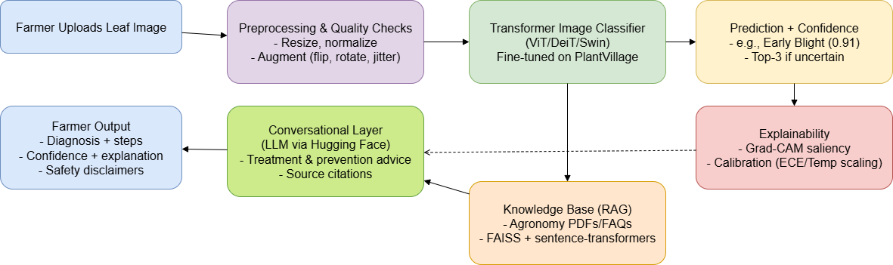

# Crop Disease Detection — From Lab to Field

> **Framing Statement (Assignment 6):**  
> We want to improve early crop disease detection for smallholder farmers and agricultural advisors by using AI to analyze leaf images with transformer-based classification and provide a conversational, retrieval‑grounded chatbot, so that farmers can identify diseases quickly, receive treatment recommendations, and reduce crop losses.



## Repo layout
```
crop-disease-detection/
├── data/               # raw/ interim/ processed/ (ImageFolder train/val/test written here)
├── notebooks/          # 00..05 notebooks (EDA, prep, train, eval, inference, compression)
├── src/                # data prep, model build/infer, train/evaluate scripts
├── app/                # Gradio app (classifier + RAG chatbot) + prompts & knowledge
├── experiments/        # configs + runs (checkpoints, logs)
└── assets/             # figures (architecture diagram)
```

## Quickstart
1. Create venv and install requirements.
2. Put datasets in `data/raw/` and run `notebooks/01_prepare_splits_preprocess.ipynb` to write `data/processed/train|val|test`.
3. Train: `python -m src.train --data data/processed --model vit_base_patch16_224 --epochs 15 --img 224`
4. Evaluate: open `notebooks/03_evaluate_report.ipynb` for metrics + confusion matrix + Grad-CAM.
5. Launch app: `python app/gradio_app.py` (optional: start a local LLM like **Ollama** for free rewriting).

## Datasets (examples)
- PlantVillage (large, curated)
- PlantDoc (field, in-the-wild)
- Cassava Leaf Disease (TFDS)
- Rice Leaf Disease (Mendeley)

> Keep a `data/dataset_cards.md` listing **source, license, classes**, and how you split/used it.

## Safety
This tool is **decision support**, not a replacement for agronomists. Always follow local regulations and label directions.
